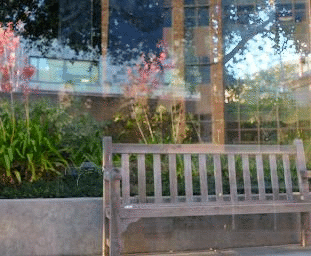
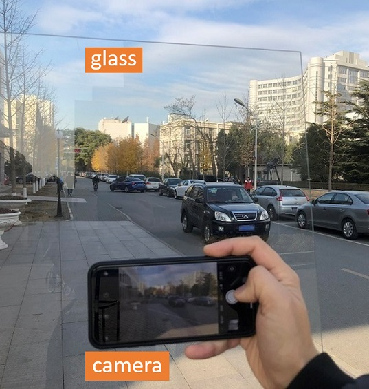
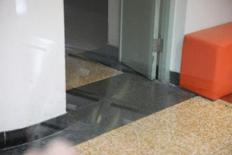

# ERRNet

The implementation of CVPR 2019 paper "[Single Image Reflection Removal Exploiting Misaligned Training Data and Network Enhancements](https://arxiv.org/abs/1904.00637)"

*News* (19/09/2019): Fix the broken link; our pretrained model and collected unaligned dataset are now available at [OneDrive](https://1drv.ms/f/s!AqddfvhavTRih3n3W0P29cxVIlfM)   

## Highlights

* Our network can extract the background image layer devoid of reflection artifacts, as in the example:

  

* We captured a new dataset containing 450 unaligned image pairs that are considerably easier to collect.
Image samples from our unaligned dataset are shown below:

    

* We introduce a simple but powerful alignment-invariant loss function to facilitate exploiting misaligned real-world training data. Finetuning on unaligned image pairs with our loss leads to sharp and reflection-free results, in contrast to the blurry ones when using a conventional pixel-wise loss (L1, L2, e.t.c.). The resulting images finetuned by different losses are shown below: (Left: Pixel-wise loss; Right: Ours)

    


## Prerequisites
* Python >=3.5, PyTorch >= 0.4.1
* Requirements: opencv-python, tensorboardX, visdom
* Platforms: Ubuntu 16.04, cuda-8.0


## Quick Start
### 1. Preparing your training/testing datasets

#### Training dataset
* 7,643 cropped images with size 224 × 224 from
  [Pascal VOC dataset](http://host.robots.ox.ac.uk/pascal/VOC/) (image ids are provided in VOC2012_224_train_png.txt, you should crop the center region with size 224 x 224 to reproduce our result). 

* 90 real-world training images from [Berkeley real dataset](https://github.com/ceciliavision/perceptual-reflection-removal) 

#### Testing dataset
* 100 synthetic testing images from [CEILNet dataset](https://github.com/fqnchina/CEILNet) (testdata_reflection_synthetic_table2) 
* 20 real testing images from [Berkeley real dataset](https://github.com/ceciliavision/perceptual-reflection-removal).  
* Three sub-datasets, namely ‘Objects’, ‘Postcard’, ‘Wild’ from [SIR^2 dataset](https://sir2data.github.io/)

Once the data are downloaded, you must organize the dataset according to our code implementation (see the source code of datasets.CEILDataset, e.t.c.)


### 2. Playing with aligned data

#### Testing
 * Download our pretrained model from [OneDrive](https://1drv.ms/f/s!AqddfvhavTRih3n3W0P29cxVIlfM) and move ```errnet_060_00463920.pt``` to ```checkpoints/errnet/```. 
 * Evaluate the model performance by ```python test_errnet.py --name errnet -r --icnn_path checkpoints/errnet/errnet_060_00463920.pt --hyper```

#### Training
* Reproduce our results by ```python train_errnet.py --name errnet --hyper``` 
* Check ```options/errnet/train_options.py``` to see more training options. 

### 3. Playing with unaligned data
* Reproduce our finetuned model by ```python train_errnet_unaligned.py --name errnet_unaligned_ft --hyper -r --icnn_path checkpoints/errnet/errnet_060_00463920.pt --unaligned_loss vgg```

## Citation

If you find our code helpful in your research or work please cite our paper.

```bibtex
 @inproceedings{wei2019single,
   title={Single Image Reflection Removal Exploiting Misaligned Training Data and Network Enhancements},
   author={Wei, Kaixuan and Yang, Jiaolong and Fu, Ying and David, Wipf and Huang, Hua},
   booktitle={IEEE Conference on Computer Vision and Pattern Recognition},
   year={2019},
 }
```

## Contact
If you find any problem, please feel free to contact me (kaixuan.wei at kaust.edu.sa).
A brief self-introduction is required, if you would like to get an in-depth help from me. 

## Acknowledgments
* Our code architecture is inspired by [CycleGAN](https://github.com/junyanz/pytorch-CycleGAN-and-pix2pix) and [EDSR](https://github.com/thstkdgus35/EDSR-PyTorch). 

* Special thanks to [@fqnchina](https://github.com/fqnchina) and [@ceciliavision](https://github.com/ceciliavision) for some discussions of this work. 
